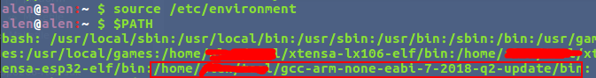

# gcc-arm-none-eabi安装

### 一  下载gcc-arm-none-eabi交叉编译器

* 1.根据不同的需求请在网址：

https://launchpad.net/gcc-arm-embedded/+download 中下载所需的代码

* 2.百度网盘 链接：https://pan.baidu.com/s/1cPrjmfIja0slfX6iWJKLYA 密码：znua

### 二  解压

通过解压缩命令

```tar -jxvf gcc-arm-none-eabi-7-2018-q2-update-linux.tar.bz2```

### 三 添加环境变量

* 使用命令：

```vim /etc/environment ```

编辑.bashrc文件，添加环境变量。

* 在该文件中PATH最后添加：

```:/home/xxx/gcc-arm-none-eabi-7-2018-q2-update/bin```

* 最后使配置文件生效： 

```source /etc/environment```

* 查看环境变量是否设置成功：

```$PATH```



